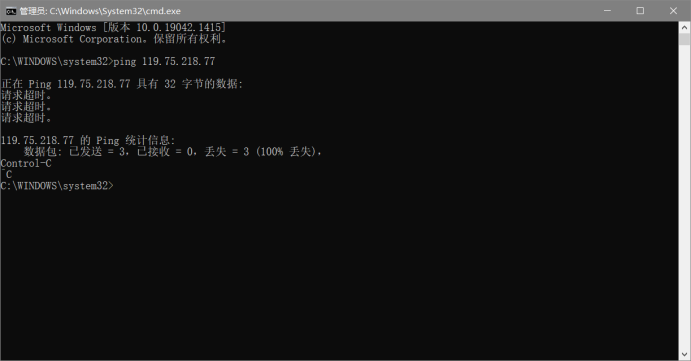

Experiment report

Index：

[TOC]

## Homework 1

### Experiment purpose：ping another computer

Experimental procedure：

- Enter "cmd" in the run bar.
- Enter "ping" and the IP address of the destination computer.
- Press Ctrl+c to terminate the process "ping".

Experimental results：

After entering the command, the server attempts to connect to the entered IP address. However, the request times out and the network connection fails.

### Experiment purpose：tracert a sever

Experimental procedure：

- Enter "cmd" in the run bar.
- Enter "tracert".

Experimental results：

After entering "tracert"，commands are as follows:

Enter "tracert www.baidu.com"，test the node line, the results are as follows:

Test the route from local node to Baidu and arrive after 14 to route.

## Homework 2

### Experiment purpose：Chapter 1  Problem 2

Equation 1.1 gives a formula for the end-to-end delay of sending one packet of length L over N links of transmission rate R. Generalize this formula for sending P such packets back-to-back over the N links. 

Experimental procedure：

- According to the topic, we' ve all ready known d(the end-to-end) = NL/R
- And when we send P such packets back-to-back, we should subtract one to avoid repeating.

 Experimental results:    (N+P-1)L/R

### Experiment purpose：Chapter 1 Problem 3

Consider an application that transmits data at a steady rate (for example, the sender generates an N-bit unit of data every k time units, where k is small and fixed). Also, when such an application starts, it will continue running for a relatively long period of time. Answer the following questions, briefly justifying your answer:
a. Would a packet-switched network or a circuit-switched network be more appropriate for this application? Why?
b. Suppose that a packet-switched network is used and the only traffic in this network comes from such applications as described above. Furthermore, assume that the sum of the application data rates is less than the capacities of each and every link. Is some form of congestion control needed? Why?

Experimental procedure：

- For question a, according to the topic, we' ve already known that we need to let the application transmit data at a steady rate and continue running for a long time. Then here is no spare time , if we choose the packet-switched network, it would increase group management overhead, such as delay.
- For question b, according to the topic, we' ve already known that the sum of the application data rates is less than the capacities of each and every link. Then there is no such a situation as congestion and queues.

 Experimental results：

- a. Circuit-switched network. Applications require a continuous transmission rate, which means that the line have no spare time. The transmission rate is fixed, so it is very convenient to reserve a certain rate of network, and won't cause the situation as insufficient speed or waste. If packet-switched networks are used, packet management costs will be increased.
- b.No. When the sum of the application data rates is less than the capacities of each and every link, congestion and queues won't happen, so there is no need to set the form of congestion control.

### Experiment purpose：Chapter 1 Problem 

Consider the circuit-switched network in Figure 1.13 . Recall that there are 4 circuits on each link. Label the four switches A, B, C, and D, going in the clockwise direction.
a. What is the maximum number of simultaneous connections that can be in progress at any one time in this network?
b. Suppose that all connections are between switches A and C. What is the maximum number of simultaneous connections that can be in progress?
c. Suppose we want to make four connections between switches A and C, and another four connections between switches B and D. Can we route these calls through the four links to accommodate all eight ­connections?

Experimental procedure：

- For question a, due to the fact that every two routers can be established 4 connections, so there are 16 connections in total.
- For question b, according to question a, we've already know that every two routers can be established 4 connections. But we have to ensure that all connections are between switches A and C, then only A-B-C and A-D-C satisfy, totally 8 connections.
- For question c, there are 4 connections between switches A and C and 4 between B and D, in the while we have to route these calls through the four links to accommodate all eight ­connections. Then the 4 connections between A and C can be divided into two A-B-C and two A-D-C, the 4 connections between B and D can be divided into two B-C-D and two B-A-D.

 Experimental results：

- a. 16
- b. 8 (4 A-B-C; 4 A-D-C)
- c. Yes.  The 4 connections between A and C can be divided into two A-B-C and two A-D-C, the 4 connections between B and D can be divided into two B-C-D and two B-A-D.

